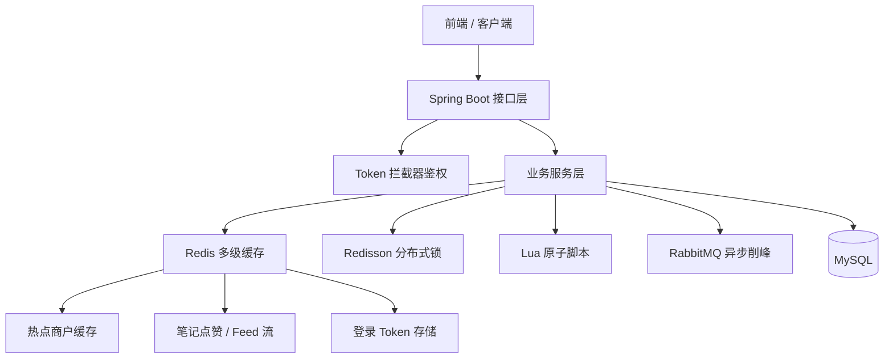

<div align="center">

# 美食打卡系统

**GastronomicCheck---inSystem**

面向高并发秒杀场景的美食探店后端服务 · 前后端分离 · 高流量 · 高一致性

<br />


</div>

---

## 项目描述

设计并实现了面向**高并发秒杀场景**的电商核心后端服务，采用**前后端分离架构**，负责用户认证、商品管理、订单履约与库存控制等核心业务模块，支撑高流量、高一致性的交易场景。

系统同时覆盖**商户查询、优惠券秒杀、探店笔记、社交关注**等业务能力，在功能实现之外，重点落地了多级缓存、分布式锁、消息队列削峰等工程化方案。

---

## 项目职责

<table>
<tr>
<td width="20%" align="center"><strong>登录校验</strong></td>
<td>
基于 <strong>Redis 存储用户 Token</strong>，配合自定义拦截器完成登录鉴权，替代原生 Session，解决集群环境下会话共享问题；支持 Token 自动续期与 ThreadLocal 用户上下文传递。
</td>
</tr>
<tr>
<td align="center"><strong>秒杀防超卖</strong></td>
<td>
采用 <strong>Lua 脚本原子扣减库存</strong> + <strong>Redisson 分布式锁</strong> 实现一人一单，配合 <strong>RabbitMQ 异步下单削峰</strong>，规避超卖与数据库瞬时高压问题。
</td>
</tr>
<tr>
<td align="center"><strong>缓存治理</strong></td>
<td>
落地<strong>旁路缓存</strong>方案，针对性解决<strong>缓存穿透、击穿、雪崩</strong>三大经典异常；结合逻辑过期与互斥重建策略，显著优化热点商户查询性能。
</td>
</tr>
<tr>
<td align="center"><strong>社交笔记</strong></td>
<td>
实现探店笔记发布、点赞、收藏逻辑，利用 <strong>Redis ZSet</strong> 构建点赞排行榜；设计用户关注模型，基于<strong>推送模式</strong>构建好友探店笔记 Feed 流，优化首页浏览查询速度。
</td>
</tr>
</table>

---

## 技术架构



---

## 技术栈

| 分类 | 技术 |
| :--- | :--- |
| 基础框架 | Spring Boot、MyBatis-Plus |
| 数据存储 | MySQL |
| 缓存中间件 | Redis、多级缓存、Lua |
| 分布式能力 | Redisson 分布式锁 |
| 消息队列 | RabbitMQ |
| 工具组件 | Lombok、Hutool |

---

## 核心模块

| 模块 | 能力说明 |
| :--- | :--- |
| 用户中心 | 短信验证码登录、Token 鉴权、用户信息管理 |
| 商户服务 | 店铺详情、分类检索、热点数据缓存加速 |
| 优惠券秒杀 | 秒杀券发布、库存扣减、一人一单、异步下单 |
| 探店笔记 | 笔记发布、点赞排行、内容 Feed 流推送 |
| 社交关系 | 用户关注 / 取关、共同关注、好友动态聚合 |
| 文件服务 | 探店图片上传与管理 |

---

## 项目结构

```text
GastronomicCheck---inSystem/
├── pom.xml
└── src/
    ├── main/
    │   ├── java/com/hmdp/
    │   │   ├── config/          # MVC、MyBatis、Redisson 配置
    │   │   ├── controller/      # REST 接口层
    │   │   ├── service/         # 业务逻辑层
    │   │   ├── mapper/          # 数据访问层
    │   │   ├── entity/          # 实体类
    │   │   ├── dto/             # 数据传输对象
    │   │   └── utils/           # 缓存、锁、拦截器等工具
    │   └── resources/
    │       ├── application.yaml # 应用配置
    │       ├── db/hmdp.sql      # 数据库初始化脚本
    │       ├── mapper/          # MyBatis XML
    │       └── unlock.lua       # Redis 解锁脚本
    └── test/                    # 单元测试
```

---

## 快速开始

### 环境要求

| 依赖 | 版本建议 |
| :--- | :--- |
| JDK | 8+ |
| Maven | 3.6+ |
| MySQL | 5.7+ |
| Redis | 5+ |
| RabbitMQ | 3.8+ |

### 1. 初始化数据库

```bash
mysql -u root -p < GastronomicCheck---inSystem/src/main/resources/db/hmdp.sql
```

### 2. 修改配置

编辑 `GastronomicCheck---inSystem/src/main/resources/application.yaml`：

```yaml
spring:
  datasource:
    url: jdbc:mysql://127.0.0.1:3306/hmdp
    username: root
    password: your_mysql_password
  redis:
    host: 127.0.0.1
    port: 6379
    password: your_redis_password
```

### 3. 启动服务

```bash
cd GastronomicCheck---inSystem
mvn spring-boot:run
```

服务默认地址：`http://localhost:8081`

---

## 接口概览

| 前缀 | 说明 |
| :--- | :--- |
| `/user` | 登录、登出、用户信息 |
| `/shop` | 商户查询与管理 |
| `/shop-type` | 商户分类 |
| `/blog` | 探店笔记、点赞、Feed 流 |
| `/follow` | 用户关注关系 |
| `/voucher` | 优惠券管理 |
| `/voucher-order` | 优惠券下单 / 秒杀 |
| `/upload` | 图片上传 |

---

## 技术亮点

- **无 Session 集群登录**：Redis Hash 存储登录态，双拦截器实现鉴权与 Token 续期
- **秒杀链路治理**：Lua 原子操作 + Redisson 锁 + MQ 异步落库，保障库存一致性
- **缓存三大问题解决**：空值缓存、逻辑过期、随机 TTL，提升热点商户访问性能
- **社交 Feed 推送**：ZSet 维护点赞榜与收件箱，滚动分页拉取关注动态

---

## 注意事项

> 请勿将真实的数据库密码、Redis 密码、MQ 凭证提交到公开仓库。

- 建议使用本地配置文件或环境变量管理敏感信息
- `.idea/`、`target/` 等 IDE 与构建产物已被 `.gitignore` 忽略

---

<div align="center">

**美食打卡 · 探店分享 · 高并发实践**

如果这个项目对你有帮助，欢迎 Star

</div>
